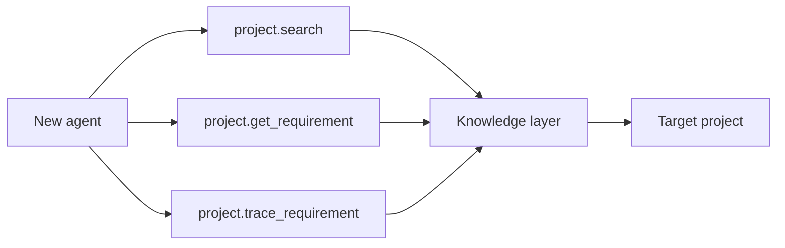
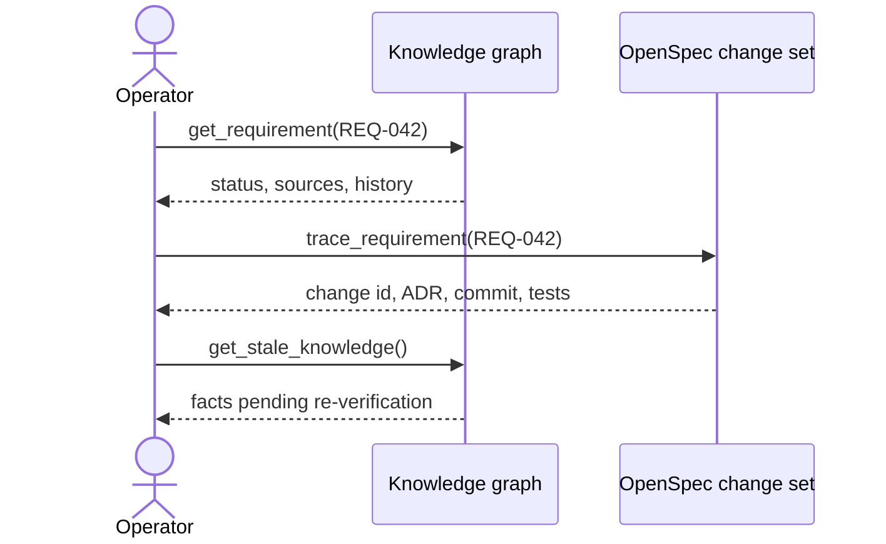
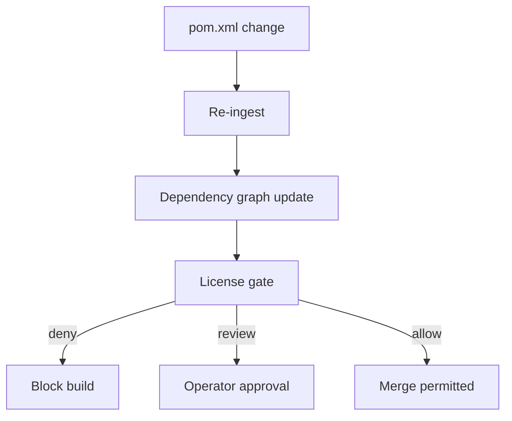
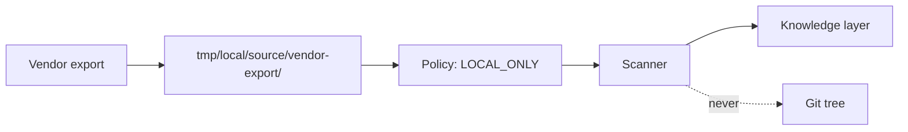
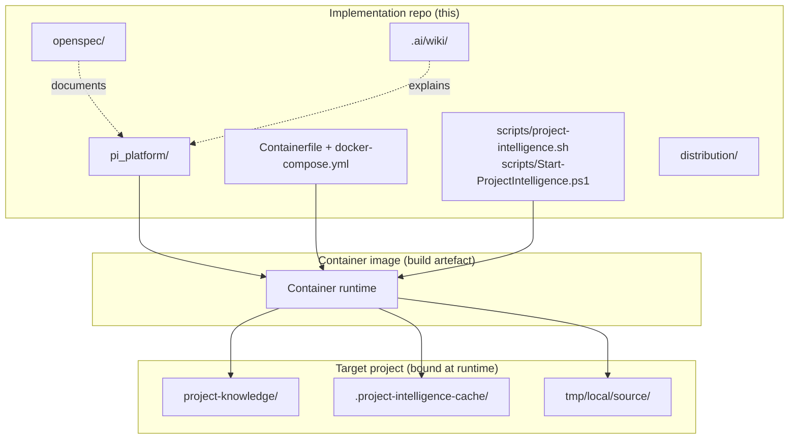
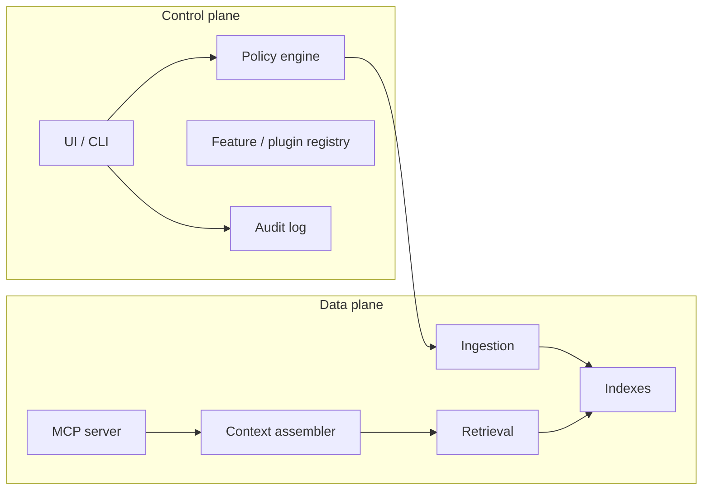
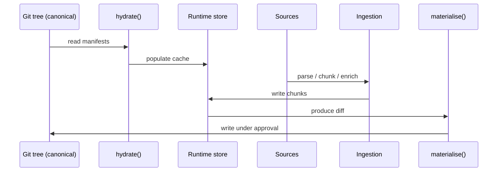

# ProjectExpert

A portable, version-aware project intelligence platform. It turns source, specs and documents into structured knowledge that any agent or UI can search, ask and trace. Ships as a single container.

## What it does

ProjectExpert binds to a target repository and operates on four layers:

The canonical knowledge tree lives in `project-knowledge/`. It is Git-versioned, human-readable and stored as deterministic JSON or YAML. Source code, parsed structures, requirements, ADRs, OpenSpec changes and Wiki pages all land here.

The runtime working store sits under `.project-intelligence-cache/`. It is gitignored and rebuilt from the canonical tree on demand. The store holds derived state: vector indexes, embedding caches, graph indices and the working-tree overlay.

The local dynamic inbox lives at `tmp/local/source/`. It accepts confidential or short-lived input that must not be committed. The scanner applies the documented `LOCAL_ONLY`, `REFERENCE` and `SNAPSHOT` policies per file.

The bidirectional round-trip links the two: `hydrate()` reads from Git and populates the runtime store; `materialise()` writes runtime changes back into the canonical tree under operator approval. A license gate blocks builds when a dependency lacks an SPDX identifier or lands in the review list.

The platform is implementation-language-neutral at the boundary. The product source tree is Python 3.11 today; Java-specific parsing lives behind language-neutral ports as `pi_platform/adapters/java/`.

## Use cases

### 1. Onboarding a new agent to an unfamiliar code base



A coding agent asks: *"what is the contract of `OrderService.cancelOrder`?"* The answer comes back with the source file, the implementing requirement ID, the OpenSpec change that introduced the requirement and the design decision that fixed the contract. No manual code spelunking.

### 2. Tracing a change back to its requirement



OpenSpec changes, ADRs, code and Git commits form one chain. The platform answers "REQ-042 changed in which change? which ADR justified the change? which tests cover it?" in a single query.

### 3. Reviewing a dependency upgrade before merge



A Maven or Gradle update re-ingests the dependency graph. Every new `Dependency` entity carries its SPDX identifier. The license gate runs against the dependency inventory and blocks the build on a missing or `deny`-class license before the change ships.

### 4. Dumping a vendor doc into the inbox



Drop a vendor export into the inbox, mark it `LOCAL_ONLY`, and the parser ingests it locally without ever committing the source bytes. Useful for confidential or short-lived material.

### 5. Auditing stale knowledge after a refactor

A refactor invalidates derived entities (entities that pointed at now-renamed classes, tests that reference moved methods). The freshness tracker surfaces them as `KnowledgeState.STALE` so the operator knows what to re-verify. The platform never rewrites authoritative knowledge silently.

### 6. Distributing the agent skill across editor hosts

The same agent Skill artefact ships for Codex, Claude Code, OpenCode and generic agents. The agent calls the platform through the documented MCP tools and respects the documented retrieval-first policy: ask the knowledge layer first, do not broad-scan the source tree for every question.

## Current architecture

Phases 0 (planning), 1 (foundation) and 2 (ingestion) are complete. Phase 2 implements document and Java/build/JAR/OpenSpec ingestion with content-addressed cache reuse and explicit source policies. Phase 3 storage remains the next work item.

### Implementation repo, container, target project



The container image binds to a target project at runtime. The implementation repo never owns the target's `project-knowledge/`, `.project-intelligence-cache/` or `tmp/local/source/`; those live inside the bound target.

### Module map (Phase 1 implemented)

```text
pi_platform/
├── core/                  # domain logic, value types, ports
│   ├── canonical/         # value types, content addressing, manifest, OKF
│   ├── git/               # CLI adapter, version identity, working-tree overlay
│   ├── sync/              # hydrate / reconcile / materialise / WAL / lock
│   └── licensing/         # policy / gate / inventory / SBOM emitter
├── ports/                 # abstract port interfaces (language-neutral)
├── adapters/
│   ├── fs/                # local filesystem adapter
│   └── git/               # git CLI adapter
├── runtime/               # content-addressed filesystem cache
└── cli/                   # `python -m pi_platform.cli` entry point
```

The Python package name is `pi_platform` (not `platform`) because `platform` collides with the Python standard-library `platform` module. The `Containerfile` and the launchers both import `pi_platform.cli`.

### Control plane and data plane



Both planes call the same policy engine for authorisation. The control plane configures and observes the data plane; it does not bypass the same rules that apply to agents and plugins. Phase 1 ships a stub policy (`PolicyDecisionStub`) that returns `ALLOW` for `hydrate` and `REQUIRE_APPROVAL` for `materialise`. The full policy engine lands in Phase 7.

### Knowledge lifecycle



The canonical tree is the source of truth. The runtime cache is derived. `materialise()` is the only operation that writes back into Git, and only after operator approval.

### Phase progression

| Phase | Name | Status |
|---|---|---|
| 0 | Plan | complete |
| 1 | Foundation (canonical, git, sync, licensing) | done |
| 2 | Ingestion (parsers, content addressing, pipeline driver, chunking, enrichment) | complete |
| 3 | Storage (runtime DB, sharded graph, provenance) | planned |
| 4 | Retrieval (hybrid, multi-stage, reranking) | planned |
| 5 | Orchestration (query, local LLM, task context) | planned |
| 6 | Agent integration (MCP, skill, adapters) | planned |
| 7 | Control plane (registry, hooks, capabilities, secrets) | planned |
| 8 | Security (enterprise boundary) | planned |
| 9 | Distribution (UI, container, OCI, one-click) | planned |
| 10 | A2A and final quality gates | planned |

The full ordered task list lives in [`openspec/changes/plan-v0-8-platform-architecture/tasks.md`](openspec/changes/plan-v0-8-platform-architecture/tasks.md). The nine accepted Phase 2 capabilities are listed in [current requirements](openspec/CURRENT.md). See [ingestion contracts](.ai/wiki/modules/ingest.md) and the [resolved Phase 2 handoff](docs/handoff/phase-2-problem-statement.md).

## Quick start

```bash
make init-mcp         # one-shot: .env, Wiki index, skills, MCP venv, client configs
make wiki-init        # validate existing Wiki and (re)build its disposable index
make check            # operator gate: config + Wiki + OpenSpec + tests + manifest
```

The portable `python` equivalents (`python harness.py <command>`) work on Linux, macOS and Windows without GNU Make. See [`docs/HARNESS_COMMANDS.md`](docs/HARNESS_COMMANDS.md) for the full setup and the manual MCP lifecycle (`run-mcp` / `stop-mcp` / `mcp-status` / `mcp-logs` / `mcp-clean` / `mcp-stdio`).

## Architectural baseline

[`project-intelligence-platform-architecture-v0.8.md`](project-intelligence-platform-architecture-v0.8.md) is the agreed architecture baseline. The Wiki at [`.ai/wiki/INDEX.md`](.ai/wiki/INDEX.md) mirrors it and links into the implementation.

## Where to find answers

| Question | File |
|---|---|
| How to use the harness | [`docs/README.md`](docs/README.md), [`docs/QUICKSTART.md`](docs/QUICKSTART.md), [`docs/HARNESS_COMMANDS.md`](docs/HARNESS_COMMANDS.md) |
| How to configure `.env` | [`docs/CONFIGURATION.md`](docs/CONFIGURATION.md) |
| What a skill does | [`.agents/skills/<name>/SKILL.md`](.agents/skills/) or [`docs/SKILLS.md`](docs/SKILLS.md) |
| How OpenSpec works | [`openspec/README.md`](openspec/README.md), [`openspec/CURRENT.md`](openspec/CURRENT.md) |
| Coding and commit conventions | [`docs/conventions/README.md`](docs/conventions/README.md) |
| Something broke | [`docs/TROUBLESHOOTING.md`](docs/TROUBLESHOOTING.md) |
| Security and secrets | [`docs/SECURITY.md`](docs/SECURITY.md) |
| Directory layout | [`docs/PROJECT_STRUCTURE.md`](docs/PROJECT_STRUCTURE.md) |
| OpenCode V1 vs V2 | [`docs/OPENCODE_COMPATIBILITY.md`](docs/OPENCODE_COMPATIBILITY.md) |
| Platform architecture (Wiki) | [`.ai/wiki/architecture/platform-overview.md`](.ai/wiki/architecture/platform-overview.md) |
| System overview (Wiki) | [`.ai/wiki/architecture/system-overview.md`](.ai/wiki/architecture/system-overview.md) |
| Implementation phases (Wiki) | [`.ai/wiki/project/implementation-roadmap.md`](.ai/wiki/project/implementation-roadmap.md) |
| Glossary | [`.ai/wiki/glossary/platform.md`](.ai/wiki/glossary/platform.md) |